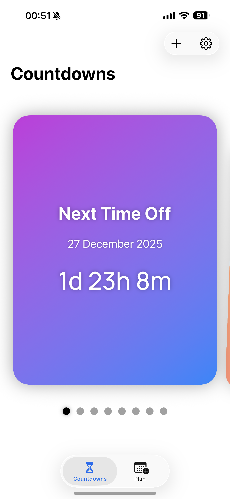
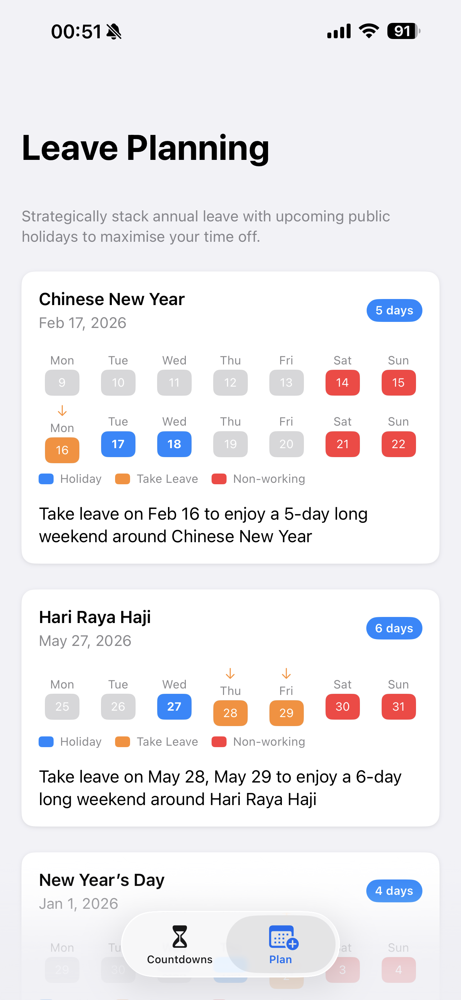
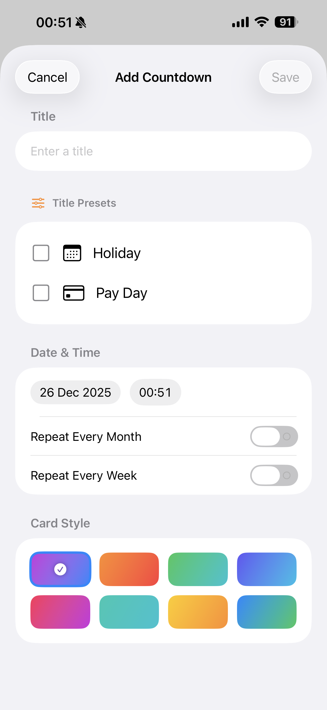

# MyNextBreak (iOS)

MyNextBreak is a SwiftUI app for Singapore that helps you answer one question fast: *when’s my next break?* It tracks your next time off, the next public holiday, and the next long weekend — and it includes a leave‑planning view that suggests when to take 1–2 days of annual leave to create 4+ day breaks.

## App Store

**Download on the iOS App Store:**
https://apps.apple.com/sg/app/mynextbreak/id6753747946

## Screenshots

  
  
  

## Features
- **Countdowns tab**
  - Swipeable, gradient countdown cards with page indicators
  - Smart “Next Time Off” card (uses your working‑days schedule; optionally includes public holidays)
  - “Next Public Holiday” and “Next Long Weekend” countdowns (Singapore calendar + timezone)
- **Custom countdowns**
  - Create unlimited personal countdowns (e.g., Holiday, Pay Day)
  - Monthly repeat (choose day of month) or weekly repeat (choose weekday + interval)
  - Edit and delete countdowns; pick a card style/gradient
- **Leave planning**
  - Recommendations around upcoming public holidays (aims for 4+ consecutive days off using up to 2 leave days)
  - Handles practical rules like Sunday holidays observed on Monday and avoiding Saturday holidays when Saturday is already non‑working
- **Home screen widget (WidgetKit)**
  - Small + medium widget that shows the countdown you picked in‑app
  - Supports default countdowns (Next Time Off / Next Public Holiday / Next Long Weekend) and any custom countdown
- **Offline-first holiday data**
  - Downloads Singapore public holiday datasets and caches them on-device
  - Shows download status (years + last updated) and lets you refresh manually
- **First‑run setup + settings**
  - Choose working days (Mon–Sun) on first launch; adjust any time in Settings
  - Toggle whether public holidays count as “Next Time Off”
  - Option to redo the initial setup flow

## Requirements
- Xcode 15+
- iOS 17.0+ (iPhone + iPad)

## Getting Started
1. Open `MyNextBreak.xcodeproj` in Xcode.
2. Select the `MyNextBreak` scheme and a simulator/device.
3. Build and run, then complete the working‑days setup.

No third‑party Swift Package dependencies are required.

## Widget Setup (Dev Notes)
The widget and app share data via an App Group.
- App Group ID is defined in `Models/WidgetCountdownConfig.swift` (`WidgetConstants.appGroupId`) and must match:
  - `MyNextBreak.entitlements`
  - `Countdown App WidgetExtension.entitlements`
- In-app: Settings → Widget → “Choose Widget Countdown”, then add the widget from the iOS home screen.

## How Holiday Data Works
- Source: data.gov.sg public holiday datasets (downloaded per-year as needed).
- Caching: stored in the app’s Documents directory as `holidaysYYYY.json` and merged on load.
- Timezone: all date calculations use `Asia/Singapore` to avoid “midnight drift”.

## Project Structure (High-Level)
- App entry: `HolidayCountdownApp.swift`
- Countdowns: `Views/ContentView.swift`, `Views/CountdownPagesView.swift`, `Views/CountdownCard.swift`
- Setup/settings: `Views/SetupView.swift`, `Views/SettingsView.swift`
- Custom countdowns: `Views/AddCountdownView.swift`, `Views/EditCustomCountdownView.swift`, `Models/CustomEvent.swift`, `Models/CustomEventStore.swift`
- Leave planning: `Views/PlanView.swift`, `Models/LeaveRecommendation.swift`
- Holidays + caching: `Models/HolidayStore.swift`, `Models/HolidayDownloader.swift`, `Models/HolidayService.swift`, `Models/HolidayAPI.swift`
- Widget: `CountdownWidget/CountdownWidget.swift`, shared data in `Models/WidgetCountdownConfig.swift`

## Privacy
- No analytics, ads, tracking, or accounts.
- Data stays on-device (working-days preference, cached holiday datasets, custom countdowns).
- Network access is only used to download public holiday datasets from data.gov.sg.
- Full policy: `privacy-policy.html`

## Acknowledgements
- Public holiday data courtesy of data.gov.sg
- Manrope typeface by Michael Sharanda (SIL Open Font License 1.1)
